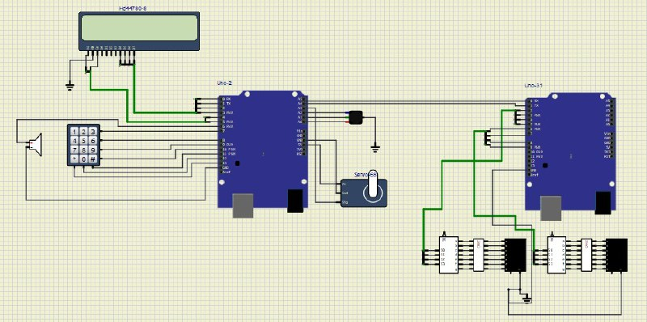

# Security Keypad Embedded System

## Overview
This project is an **Embedded System** implementation for a Security Keypad. It features a password-protected system that authenticates users and allows access based on predefined logic. The project is designed to work on a microcontroller, with hardware and software components integrated to achieve a secure and functional .

---

## Hardware Design
  

---

## Features
- **User Authentication:** Users must input the correct password to gain access.
- **Alert System:** Triggers alerts upon incorrect password attempts.
- **Hardware Integration:** Includes keypad input and output display on an LCD.
- **Embedded Software:** Developed in C using AVR microcontroller libraries.

---

## Components
### Hardware:
1. **Microcontroller:** AVR (e.g., ATmega32 or equivalent).
2. **Keypad:** 4x3 matrix keypad for user input.
3. **LCD:** 16x2 LCD for displaying messages.
4. **Buzzer:** Used for alerts or error indications.
5. **Power Supply:** Standard 5V DC.
6. **Wires and Resistors:** For proper connections.

### Software:
1. Embedded C code, developed using:
   - AVR-GCC Compiler.
   - Atmel Studio or equivalent IDE.
2. Libraries:
   - LCD control library.
   - Keypad scanning library.
   - EEPROM library for password storage.

---

## How to Use
### Setup:
1. Connect the hardware components as per the circuit diagram provided in the repository.
2. Flash the microcontroller with the provided firmware.
3. Power on the system.

### Default Password:
There is no default password set initially. Users must set a password during the first operation.

### Operation:
1. Enter the password on the keypad.
   - If correct, access is granted, and a success message is displayed.
   - If incorrect, an error message is displayed, and the buzzer will sound.
2. After 3 incorrect attempts, the system locks and triggers an alert.

---

## Installation and Compilation
1. Clone the repository:
   ```bash
   git clone https://github.com/Eman288/Security-Keypad-Embedded-System.git
   ```
2. Open the project in Atmel Studio or another AVR development environment.
3. Connect your microcontroller to the programmer.
4. Compile and flash the code to the microcontroller.

---

## How It Works
1. The system initializes and displays a welcome message on the LCD.
2. The user inputs a password using the keypad.
3. The password is checked against the stored value in the EEPROM:
   - **Correct Password:** Grants access.
   - **Incorrect Password:** Increments the failed attempt counter and triggers an alert after 3 consecutive failures.

---

## contributors
1.  **Name:** Eman Tamam
       **GitHub Profile:** [https://github.com/Eman288](https://github.com/Eman288)
2.  **Name:** Aya Sabry
       **GitHub Profile:** [https://github.com/ayasabry36](https://github.com/ayasabry36)
3.  **Name:** Arwa Mostafa
       **GitHub Profile:** [https://github.com/ArwaMostafa19](https://github.com/ArwaMostafa19)
4.  **Name:** Batoul Essam
       **GitHub Profile:** [https://github.com/Batoul810](https://github.com/Batoul810)
5.  **Name:** Yasmeen 
       **GitHub Profile:** [https://github.com/YasmeenFci](https://github.com/YasmeenFci)

---

## License
This project is licensed under the MIT License. See the [LICENSE](LICENSE) file for more details.

---

Thank you for checking out this project! Your feedback and contributions are greatly appreciated.
